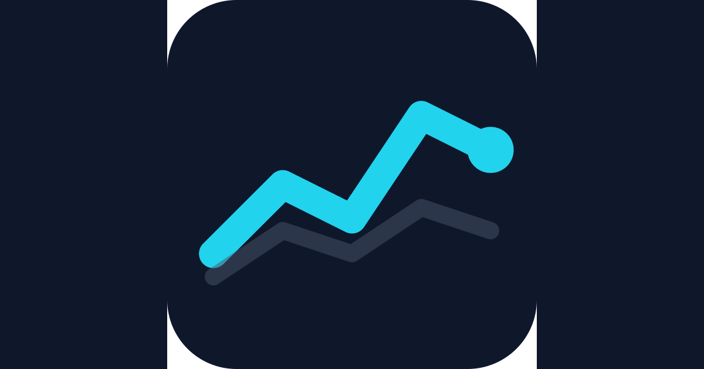

# NeuroTrade

**Read the news. Beat the market. Prove your edge.**

[](https://neuro-game.yeomniverse.com/)
[](https://react.dev/)
[](https://www.typescriptlang.org/)
[](https://vitejs.dev/)
[](https://supabase.com/)
[](https://web.dev/progressive-web-apps/)
[](./LICENSE)

---



---

## What is NeuroTrade?

NeuroTrade is a browser-based trading simulation game. Each round you receive breaking fictional news and must decide — quickly — which stocks to buy or sell. Your decisions compound across multiple trading days. At the end, your return percentage is ranked on a global leaderboard.

No real money. No prior finance knowledge required. Just sharp information analysis.

---

## Features

- **News-driven gameplay** — Every price move is triggered by in-game headlines. Read carefully.
- **Candlestick charts** — OHLC price history rendered with Recharts for an authentic market feel.
- **Global leaderboard** — Scores synced via Supabase Realtime. Compete with anyone, anywhere.
- **Bilingual** — Full English and Korean support throughout the UI and all game content.
- **PWA-ready** — Installable on mobile, works offline after first load.
- **Multiple game modes** — Six distinct ways to play (see below).
- **Shareable duels** — Challenge a friend with a unique URL seed so you both play the same scenario.
- **Daily streaks** — Check in every day to maintain your attendance streak.
- **Achievements** — Unlock badges for trading milestones and performance records.

---

## Game Modes

| Mode | Description | Length |
|---|---|---|
| **Classic** | Standard trading cycle driven by a narrative arc. Balanced for all players. | 5 days |
| **Advanced** | Faster price swings, stronger market gravity, and scaled news effects. | 10 days |
| **Flash Round** | Rapid-fire trading under time pressure. One wrong read ends the round. | Short burst |
| **Daily Challenge** | A shared scenario that resets every 24 hours. Everyone plays the same seed. | 1 session |
| **Duel** | Generate a challenge link and share it. Your opponent plays the identical market. | 5 days |
| **Live Competition** *(Beta)* | Real-time multiplayer. All participants trade simultaneously with live presence tracking. | Variable |

---

## Tech Stack

| Layer | Technology |
|---|---|
| UI framework | React 18 + TypeScript |
| Build tool | Vite 5 |
| State management | Zustand 5 |
| Charts | Recharts 3 (`ComposedChart` + `Bar`) |
| Backend / Realtime | Supabase (`@supabase/supabase-js`) |
| URL state | nuqs |
| Icons | lucide-react |
| Analytics | Vercel Analytics |
| Styling | Custom CSS — no CSS framework |
| PWA | `public/manifest.json` |

---

## Getting Started

**Prerequisites:** Node.js 18+ and [pnpm](https://pnpm.io/)

```bash
# Clone the repo
git clone https://github.com/prgmr99/trading-game.git
cd trading-game

# Install dependencies
pnpm install

# Start the dev server (http://localhost:5173)
pnpm dev
```

### Other commands

```bash
# Type-check and build for production (output -> dist/)
pnpm build

# Preview the production build locally
pnpm preview

# Run ESLint
pnpm lint
```

---

## Architecture

NeuroTrade is a single-page application. All game logic runs client-side; Supabase handles persistence and real-time multiplayer only.

### State

Two Zustand stores own all runtime state:

- **`src/store/gameStore.ts`** — Portfolio (cash + holdings), stock prices, day counter, and news feed. The `nextDay()` action is the game engine: it applies news multipliers with random volatility noise, generates OHLC candlestick data, and advances the day.
- **`src/store/useLanguageStore.ts`** — Active language (`en` / `ko`), persisted to `localStorage`.

### Project structure

```
src/
├── components/       # React components (Layout, Market, Portfolio, StockChart, ...)
├── store/            # Zustand stores (gameStore, useLanguageStore, achievementStore, ...)
├── hooks/            # Custom hooks (useAuth, useLiveMarket)
├── i18n/             # translations.ts + useTranslation hook
├── data/             # Scenarios, stock profiles, news arcs
├── lib/              # Utilities (supabase, prng, achievements, sounds, shareText)
└── types.ts          # TypeScript interfaces
```

---

## Contributing

1. Fork the repository and create a feature branch.
2. Run `pnpm dev` and verify your changes locally.
3. Run `pnpm lint` — fix any reported issues before committing.
4. Open a pull request with a clear description of what changed and why.

---

## License

MIT
